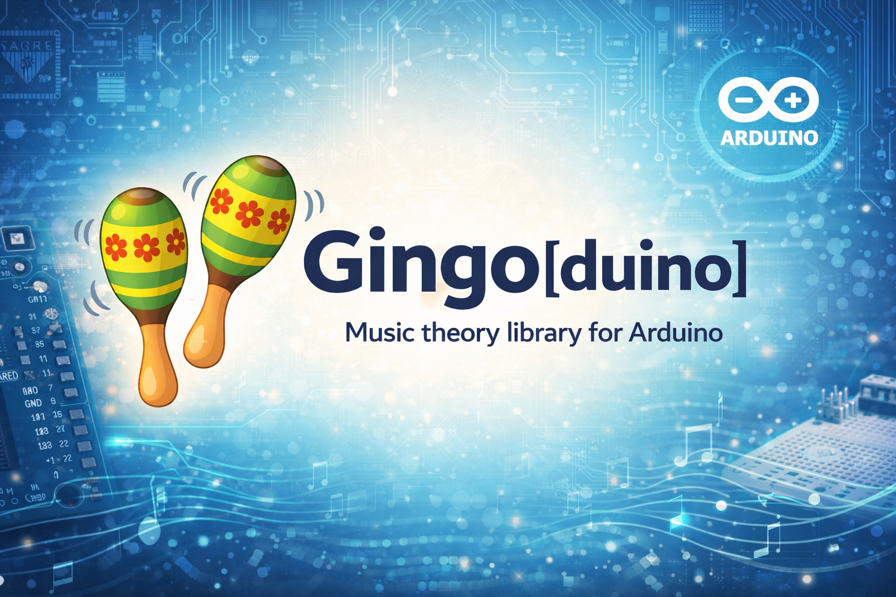

<p align="center">
  
</p>

# 🪇 Gingo[duino]

**Music Theory Engine for Embedded Systems** | **Biblioteca de Teoria Musical para Sistemas Embarcados**

<p align="center">
  <a href="https://www.arduino.cc/reference/en/libraries/gingoduino/"></a>
  <a href="https://registry.platformio.org/libraries/sauloverissimo/Gingoduino"></a>
  <a href="https://github.com/sauloverissimo/gingoduino"></a>
  <a href="https://github.com/sauloverissimo/gingoduino/blob/main/LICENSE"></a>
</p>

---

## English

### Overview

Gingoduino is a music theory engine for embedded systems. It brings notes, intervals, chords, scales, harmonic fields, fretboard engine, musical events, and sequences to Arduino, ESP32, Teensy, Daisy Seed, Raspberry Pi Pico, and other platforms.

Built as a port of the [gingo C++17 library](https://github.com/sauloverissimo/gingo). Zero-heap architecture, PROGMEM lookup tables, C++11 compatible.

### Modules

| Tier | Modules | Platforms |
|------|---------|-----------|
| 1 | Note, Interval, Chord | AVR (Uno, Nano) |
| 2 | + Scale, Field, Duration, Tempo, TimeSig, Fretboard | ESP8266 |
| 3 | + Event, Sequence, Tree, Progression | ESP32, RP2040, Teensy, Daisy Seed |

Tiers auto-select based on platform, or override with `#define GINGODUINO_TIER N`.

### Features

- 12-note chromatic system with enharmonic equivalents
- 42 chord formulas with reverse lookup (identify)
- 40+ scale types and modes with signature, brightness, relative/parallel
- Harmonic field analysis with T/S/D functions and roles (+ deduce from notes/chords)
- Harmonic tree (directed graph, major/minor, classical + jazz traditions)
- Progression analysis: identify, deduce (ranked), predict (next branch)
- Fretboard engine: violao, cavaquinho, bandolim, ukulele with fingering scoring
- Musical events (note, chord, rest) and sequences with tempo/time signature
- Fixed-size arrays, no dynamic allocation, PROGMEM support
- Compatible with Arduino IDE, PlatformIO, and ESP-IDF
- 275 native tests passing

### Installation

**Arduino IDE Library Manager:**
- Sketch > Include Library > Manage Libraries > Search `Gingoduino` > Install

**PlatformIO:**
```ini
; platformio.ini
lib_deps = sauloverissimo/Gingoduino
```

**ESP-IDF Component:**
```bash
idf.py add-dependency "sauloverissimo/gingoduino"
```

**Manual:**
- Download and copy to your Arduino libraries folder (`~/Arduino/libraries/`)

### Quick Start

```cpp
#include <Gingoduino.h>

using namespace gingoduino;

void setup() {
    Serial.begin(9600);

    GingoNote note("C");
    Serial.println(note.name());           // "C"
    Serial.println(note.midiNumber(4));    // 60
    Serial.println(note.frequency(4), 1);  // 261.6

    GingoNote fifth = note.transpose(7);   // G

    GingoChord chord("Dm7");
    GingoNote notes[7];
    uint8_t n = chord.notes(notes, 7);     // D, F, A, C

    GingoScale scale("C", SCALE_MAJOR);
    Serial.println(scale.signature());     // 0 (no sharps/flats)

    GingoField field("C", SCALE_MAJOR);
    GingoChord triads[7];
    field.chords(triads, 7);               // CM, Dm, Em, FM, GM, Am, Bdim
}

void loop() {}
```

### API Reference

#### GingoNote
```cpp
GingoNote note("C#");
note.name();              // "C#"
note.natural();           // "C" (sharp canonical)
note.semitone();          // 1 (0-11)
note.frequency(4);        // Hz (float)
note.midiNumber(4);       // 0-127
note.transpose(7);        // GingoNote
note.distance(other);     // circle of fifths
note.isEnharmonic(other); // bool
```

#### GingoInterval
```cpp
GingoInterval iv("5J");         // or GingoInterval(7) or GingoInterval(noteA, noteB)
char buf[32];
iv.label(buf, sizeof(buf));     // "5J"
iv.semitones();                 // 7
iv.degree();                    // 5
iv.consonance(buf, sizeof(buf));// "perfect", "imperfect", or "dissonant"
iv.isConsonant();               // true
iv.fullName(buf, sizeof(buf));  // "Perfect Fifth"
iv.fullNamePt(buf, sizeof(buf));// "Quinta Justa"
iv.simple();                    // reduce compound to simple
iv.invert();                    // complement within octave
GingoInterval sum = iv + other; // capped at 23
```

#### GingoChord
```cpp
GingoChord chord("Dm7");
chord.name();                         // "Dm7"
chord.root();                         // GingoNote("D")
chord.type();                         // "m7"
chord.size();                         // 4

GingoNote notes[7];
chord.notes(notes, 7);                // fill array with chord tones

GingoInterval ivs[7];
chord.intervals(ivs, 7);              // GingoInterval objects

chord.contains(GingoNote("F"));       // true
chord.transpose(5);                   // GingoChord

GingoNote arr[3] = {GingoNote("C"), GingoNote("E"), GingoNote("G")};
char name[16];
GingoChord::identify(arr, 3, name, 16); // "CM"
```

#### GingoScale
```cpp
GingoScale scale("C", SCALE_MAJOR);   // or GingoScale("C", "dorian")
char buf[22];
scale.modeName(buf, sizeof(buf));      // "Ionian"
scale.quality();                       // "major" or "minor"
scale.signature();                     // 0 (sharps>0, flats<0)
scale.brightness();                    // 1-7 (higher = brighter)
scale.mask();                          // 12-bit pitch-class mask

GingoNote notes[12];
scale.notes(notes, 12);               // fill with scale degrees
scale.degree(5);                       // GingoNote at degree
scale.degreeOf(GingoNote("G"));        // 5 (0 if not found)
scale.contains(GingoNote("F"));        // true

scale.mode(2);                         // Dorian
scale.pentatonic();                    // pentatonic version
scale.relative();                      // relative major/minor
scale.parallel();                      // parallel major/minor
```

#### GingoField
```cpp
GingoField field("C", SCALE_MAJOR);
GingoChord triads[7];
field.chords(triads, 7);              // CM, Dm, Em, FM, GM, Am, Bdim
GingoChord sevs[7];
field.sevenths(sevs, 7);              // C7M, Dm7, Em7, F7M, G7, Am7, Bm7(b5)

field.function(5);                     // FUNC_DOMINANT
char buf[12];
field.role(1, buf, sizeof(buf));       // "primary"

field.functionOf(GingoChord("GM"));    // FUNC_DOMINANT
field.functionOf("Dm7");               // FUNC_SUBDOMINANT
field.roleOf("Em", buf, sizeof(buf));  // "transitive"
field.signature();                     // 0
```

#### GingoFretboard
```cpp
GingoFretboard guitar = GingoFretboard::violao();   // 6 strings, 19 frets
// Also: ::cavaquinho(), ::bandolim(), ::ukulele()

guitar.noteAt(0, 5);                  // GingoNote("A") — string 0, fret 5
guitar.midiAt(0, 0);                  // 40 (E2)

GingoFretPos positions[48];
guitar.positions(GingoNote("E"), positions, 48);
guitar.scalePositions(scale, positions, 48, 0, 4);

GingoFingering fg;
guitar.fingering(GingoChord("CM"), 0, fg); // best fingering at position 0

GingoFingering fgs[5];
guitar.fingerings(GingoChord("CM"), fgs, 5); // up to 5 fingerings

GingoFretboard capo2 = guitar.capo(2);      // transposed fretboard
```

#### GingoEvent & GingoSequence (Tier 3)
```cpp
GingoEvent ne = GingoEvent::noteEvent(GingoNote("C"), GingoDuration("quarter"), 4);
GingoEvent ce = GingoEvent::chordEvent(GingoChord("CM"), GingoDuration("half"));
GingoEvent re = GingoEvent::rest(GingoDuration("quarter"));

ne.type();          // EVENT_NOTE
ne.midiNumber();    // 60
ne.frequency();     // 261.6
ne.transpose(7);    // GingoEvent (G4)

GingoSequence seq(GingoTempo(120), GingoTimeSig(4, 4));
seq.add(ne);
seq.add(re);
seq.totalBeats();   // 2.0
seq.totalSeconds(); // 1.0 at 120 BPM
seq.barCount();     // 0.5
seq.transpose(5);   // transpose all events
```

### Examples

| Example | Description | Tier |
|---------|-------------|------|
| BasicNote | Note creation, transposition, MIDI, frequency | 1 |
| ChordNotes | Chord notes, intervals, identify | 1 |
| ScaleExplorer | Scales, modes, pentatonic | 2 |
| HarmonicField | Triads, sevenths, harmonic functions | 2 |
| TDisplayS3Explorer | 7-page interactive GUI on LilyGo T-Display S3 | 3 |

#### T-Display S3 Explorer

Interactive demo on LilyGo T-Display S3 (ESP32-S3, 170x320 TFT, TFT_eSPI) with real-time audio synthesis via I2S DAC.

<p align="center">
  
</p>

**Setup:** Install TFT_eSPI, configure for T-Display S3 (`Setup206_LilyGo_T_Display_S3.h`).

**Navigation:** BOOT = switch page, KEY = cycle items.

**Pages:**

| Page | Description |
|:---:|:---|
|  | **Note Explorer** — MIDI, frequency, chromatic bar |
|  | **Interval Explorer** — Consonance, full names EN/PT |
|  | **Chord Explorer** — Notes, intervals, consonance colors |
|  | **Scale Explorer** — Brightness, relative/parallel |
|  | **Fretboard** — Chord fingerings and scale overlays |

Additional pages: **Harmonic Field** (triads, T/S/D functions, sevenths) and **Sequence** (timeline with beat grid).

### MIDI Support (v0.2.0+)

Gingoduino includes bidirectional MIDI conversion and serialization for integration with synthesizers, sequencers, and audio analyzers.

#### GingoNote — MIDI Conversion

```cpp
// Convert MIDI → Note
GingoNote note = GingoNote::fromMIDI(60);         // "C"
int8_t octave = GingoNote::octaveFromMIDI(60);    // 4

// Convert Note → MIDI
uint8_t midi = note.midiNumber(4);                // 60
```

#### GingoEvent — MIDI Serialization (v0.2.1+)

```cpp
// Create event with velocity and channel
GingoEvent e = GingoEvent::noteEvent(
    GingoNote("C"),
    GingoDuration("quarter"),
    4,      // octave
    100,    // velocity (0-127)
    1       // MIDI channel (1-16)
);

// Access and modify
e.velocity();           // 100
e.setVelocity(64);
e.midiChannel();        // 1
e.setMidiChannel(2);

// Serialize to raw MIDI bytes
uint8_t buf[6];
uint8_t written = e.toMIDI(buf);  // NoteOn + NoteOff
```

#### GingoSequence — MIDI Export

```cpp
GingoSequence seq(GingoTempo(120), GingoTimeSig(4, 4));
seq.add(GingoEvent::noteEvent(GingoNote("C"), GingoDuration("quarter"), 4));
seq.add(GingoEvent::noteEvent(GingoNote("E"), GingoDuration("quarter"), 4));

uint8_t buf[256];
uint16_t len = seq.toMIDI(buf, sizeof(buf), 1);  // Export to MIDI bytes
```

#### MIDI Examples

| Example | Description | Tier |
|---------|-----------|------|
| MIDI_to_Gingoduino | Receive MIDI USB/BLE, analyze with Gingoduino | 3 |
| RealtimeChordIdentifier | Identify chords from simultaneous notes | 3 |
| Gingoduino_to_MIDI | Create sequence, export as MIDI serial | 3 |

### Native Testing

```bash
g++ -std=c++11 -DGINGODUINO_TIER=3 -I. -Wall -Wextra \
    -o extras/tests/test_native extras/tests/test_native.cpp \
    && ./extras/tests/test_native
```

275 tests, 0 failures. No Arduino framework needed.

### License

MIT License — See [LICENSE](LICENSE)

### Author

**Saulo Verissimo**
- https://github.com/sauloverissimo
- sauloverissimo@gmail.com

---

## Portugues

### Visao Geral

Gingoduino é um motor de teoria musical para sistemas embarcados. Traz notas, intervalos, acordes, escalas, campos harmônicos, engine de instrumentos de cordas, eventos musicais e sequências para Arduino, ESP32, Teensy, Daisy Seed, Raspberry Pi Pico e outras plataformas.

Port da [biblioteca gingo C++17](https://github.com/sauloverissimo/gingo). Arquitetura zero-heap, tabelas PROGMEM, compativel C++11.

### Modulos

| Tier | Modulos | Plataformas |
|------|---------|-------------|
| 1 | Note, Interval, Chord | AVR (Uno, Nano) |
| 2 | + Scale, Field, Duration, Tempo, TimeSig, Fretboard | ESP8266 |
| 3 | + Event, Sequence, Tree, Progression | ESP32, RP2040, Teensy, Daisy Seed |

Tiers auto-detectados por plataforma, ou force com `#define GINGODUINO_TIER N`.

### Caracteristicas

- Sistema cromatico de 12 notas com enarmonicos
- 42 formulas de acordes com lookup reverso (identify)
- 40+ tipos de escalas e modos com armadura, brilho, relativa/paralela
- Analise de campo harmonico com funcoes T/S/D e roles (+ deduce a partir de notas/acordes)
- Arvore harmonica (grafo dirigido, major/minor, tradicoes classica + jazz)
- Analise de progressao: identify, deduce (ranked), predict (proximo branch)
- Engine de braco: violao, cavaquinho, bandolim, ukulele com scoring de digitacao
- Eventos musicais (nota, acorde, pausa) e sequencias com tempo/compasso
- Arrays de tamanho fixo, sem alocacao dinamica, suporte PROGMEM
- Compativel com Arduino IDE, PlatformIO e ESP-IDF
- 275 testes nativos passando

### Instalacao

**Arduino IDE Library Manager:**
- Sketch > Include Library > Manage Libraries > Buscar `Gingoduino` > Install

**PlatformIO:**
```ini
; platformio.ini
lib_deps = sauloverissimo/Gingoduino
```

**ESP-IDF Component:**
```bash
idf.py add-dependency "sauloverissimo/gingoduino"
```

**Manual:**
- Baixe e copie para sua pasta de bibliotecas Arduino (`~/Arduino/libraries/`)

### Uso Rapido

```cpp
#include <Gingoduino.h>

using namespace gingoduino;

void setup() {
    Serial.begin(9600);

    GingoNote nota("C");
    Serial.println(nota.name());           // "C"
    Serial.println(nota.midiNumber(4));    // 60
    Serial.println(nota.frequency(4), 1);  // 261.6

    GingoNote quinta = nota.transpose(7);  // G

    GingoChord acorde("Dm7");
    GingoNote notas[7];
    uint8_t n = acorde.notes(notas, 7);

    GingoScale escala("C", SCALE_MAJOR);
    Serial.println(escala.signature());    // 0

    GingoField campo("C", SCALE_MAJOR);
    GingoChord triades[7];
    campo.chords(triades, 7);              // CM, Dm, Em, FM, GM, Am, Bdim
}

void loop() {}
```

### Exemplos

| Exemplo | Descricao | Tier |
|---------|-----------|------|
| BasicNote | Criacao de notas, transposicao, MIDI, frequencia | 1 |
| ChordNotes | Notas de acordes, intervalos, identify | 1 |
| ScaleExplorer | Escalas, modos, pentatonica | 2 |
| HarmonicField | Triades, tetrades, funcoes harmonicas | 2 |
| TDisplayS3Explorer | GUI interativa com 7 paginas no LilyGo T-Display S3 | 3 |

#### T-Display S3 Explorer

Demo interativo no LilyGo T-Display S3 (ESP32-S3, 170x320 TFT, TFT_eSPI) com sintese de audio em tempo real via I2S DAC.

<p align="center">
  
</p>

**Setup:** Instale TFT_eSPI, configure para T-Display S3 (`Setup206_LilyGo_T_Display_S3.h`).

**Navegacao:** BOOT = trocar pagina, KEY = proximo item.

**Páginas:**

| Página | Descrição |
|:---:|:---|
|  | **Note Explorer** — MIDI, frequência, barra cromática |
|  | **Interval Explorer** — Consonância, nomes EN/PT |
|  | **Chord Explorer** — Notas, intervalos, cores de consonância |
|  | **Scale Explorer** — Brilho, relativa/paralela |
|  | **Fretboard** — Digitações de acordes e overlay de escalas |

Páginas adicionais: **Harmonic Field** (tríades, funções T/S/D, tétrades) e **Sequence** (timeline com grid de beats).

### MIDI Support (v0.2.0+)

Gingoduino inclui conversão MIDI bidirecional e serialização para integração com sintetizadores, sequenciadores e analisadores de áudio.

#### GingoNote — MIDI Conversion

```cpp
// Converter MIDI → Nota
GingoNote note = GingoNote::fromMIDI(60);         // "C"
int8_t octave = GingoNote::octaveFromMIDI(60);    // 4

// Converter Nota → MIDI
uint8_t midi = note.midiNumber(4);                // 60
```

#### GingoEvent — MIDI Serialization (v0.2.1+)

```cpp
// Criar evento com velocity e channel
GingoEvent e = GingoEvent::noteEvent(
    GingoNote("C"),
    GingoDuration("quarter"),
    4,      // octave
    100,    // velocity (0-127)
    1       // MIDI channel (1-16)
);

// Acessar e modificar
e.velocity();           // 100
e.setVelocity(64);
e.midiChannel();        // 1
e.setMidiChannel(2);

// Serializar para bytes MIDI raw
uint8_t buf[6];
uint8_t written = e.toMIDI(buf);  // NoteOn + NoteOff
```

#### GingoSequence — MIDI Export

```cpp
GingoSequence seq(GingoTempo(120), GingoTimeSig(4, 4));
seq.add(GingoEvent::noteEvent(GingoNote("C"), GingoDuration("quarter"), 4));
seq.add(GingoEvent::noteEvent(GingoNote("E"), GingoDuration("quarter"), 4));

uint8_t buf[256];
uint16_t len = seq.toMIDI(buf, sizeof(buf), 1);  // Export to MIDI bytes
```

#### Exemplos MIDI

| Exemplo | Descricao | Tier |
|---------|-----------|------|
| MIDI_to_Gingoduino | Recebe MIDI USB/BLE, analisa com Gingoduino | 3 |
| RealtimeChordIdentifier | Identifica acordes de notas simultâneas | 3 |
| Gingoduino_to_MIDI | Cria sequência, exporta como MIDI serial | 3 |

### Native Tests

```bash
g++ -std=c++11 -DGINGODUINO_TIER=3 -I. -Wall -Wextra \
    -o extras/tests/test_native extras/tests/test_native.cpp \
    && ./extras/tests/test_native
```

275 testes, 0 falhas. Sem framework Arduino.

### Licenca

MIT License — Veja [LICENSE](LICENSE)

### Autor

**Saulo Verissimo**
- https://github.com/sauloverissimo
- sauloverissimo@gmail.com
