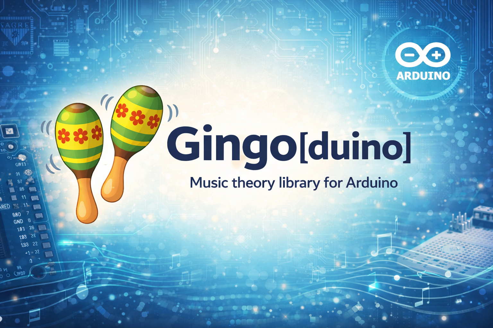

<p align="center">
  
</p>

# 🪇 Gingo[duino]

**Music Theory Engine for Embedded Systems**

<p align="center">
  <a href="https://github.com/sauloverissimo/gingoduino/actions/workflows/ci.yml"></a>
  <a href="https://www.arduino.cc/reference/en/libraries/gingoduino/"></a>
  <a href="https://registry.platformio.org/libraries/sauloverissimo/Gingoduino"></a>
  <a href="https://github.com/sauloverissimo/gingoduino"></a>
  <a href="https://github.com/sauloverissimo/gingoduino/blob/main/src/GingoMIDI2.h"></a>
  <a href="https://github.com/sauloverissimo/gingoduino/blob/main/LICENSE"></a>
</p>

<p align="center">
  <a href="https://github.com/sponsors/sauloverissimo"></a>
</p>

> Versão em português brasileiro: [README_ptbr.md](README_ptbr.md)

---

## Overview

Gingoduino is a music theory engine for embedded systems. It owns the musical domain (notes, intervals, chords, scales, harmonic fields, harmonic trees, progression analysis, fretboard engine), a real-time harmonic monitor, and stateless output adapters that translate musical structures into serialized formats (raw MIDI 1.0 bytes and MIDI 2.0 UMP Flex Data).

It does not own the wire. Byte stream parsing, UMP receive dispatch, and MIDI-CI discovery and Property Exchange are protocol concerns delegated to dedicated libraries: `midi2_cpp` for UMP, Arduino MIDI Library or your own parser for MIDI 1.0 byte streams, the [`midi2`](https://github.com/sauloverissimo/midi2) C99 library for MIDI-CI responders.

Ported from the [gingopy C++17 library](https://github.com/sauloverissimo/gingopy). Zero-heap architecture, PROGMEM lookup tables, C++11 compatible.

> **0.4.0 is a breaking release.** See [CHANGELOG.md](CHANGELOG.md) for the migration guide if you are upgrading from 0.3.x.

## Architecture

```
┌─────────────────┐    musical event      ┌──────────────────┐
│   Transport     │ ──────────────────▶   │   GingoMonitor   │
│  (midi2_cpp,    │ noteOn / noteOff /    │  chord, field,   │
│   Arduino MIDI, │ sustainOn / Off       │  per-note ctx    │
│   ESP32_Host_   │                       └────────┬─────────┘
│   MIDI, ...)    │                                │
└─────────────────┘                                │
        ▲                                          ▼
        │            ┌─────────────────────────────────┐
        │            │      Theory + Analysis           │
        │            │  Note · Interval · Chord ·       │
        │            │  Scale · Field · Tree ·          │
        │            │  Progression · Comparison ·      │
        │            │  Fretboard · Event · Sequence    │
        │            └─────────────────┬────────────────┘
        │                              │
        │                              ▼
        │            ┌─────────────────────────────────┐
        │            │      Output adapters             │
        │  bytes /   │  GingoMIDI1::fromEvent           │
        └────────────┤  GingoMIDI1::fromSequence        │
            UMP      │  GingoMIDI2::chordName           │
                     │  GingoMIDI2::keySignature        │
                     │  GingoMIDI2::perNoteController   │
                     └─────────────────────────────────┘
```

The transport sits outside the library. It parses bytes or UMP packets and feeds the Monitor through the musical-event API. Anything Gingoduino computes can be turned back into bytes or UMP through the namespaced output adapters.

## Modules

| Tier | Modules | Platforms |
|------|---------|-----------|
| 1 | Note, Interval, Chord | AVR (Uno, Nano), best-effort, no CI |
| 2 | + Scale, Field, Duration, Tempo, TimeSig, Fretboard, NoteContext, Monitor, MIDI1 adapters | ESP8266 |
| 3 | + Event, Sequence, Tree, Progression, ChordComparison, MIDI2 adapters | ESP32, RP2040, Teensy, Daisy Seed |

Tiers are auto-selected based on the target platform. To force a tier, define `GINGODUINO_TIER N` before including `Gingoduino.h`.

## Features

- 12-note chromatic system with enharmonic equivalents
- 42 chord formulas with reverse lookup (identify)
- 40+ scale types and modes with signature, brightness, relative and parallel
- Harmonic field analysis with T/S/D functions and roles, plus deduction from notes and chords
- Harmonic tree (directed graph, major and minor, classical and jazz traditions)
- Progression analysis: identify, deduce (ranked), predict (next branch)
- Fretboard engine: guitar, violao, cavaquinho, mandolim, ukulele; alternate tunings (Drop D, Open G, DADGAD); common chords and open-position fingerings
- Musical events (note, chord, rest) and sequences with tempo and time signature
- Real-time harmonic monitor with chord and field detection plus per-note context
- MIDI 1.0 output adapters: `GingoMIDI1::fromEvent`, `GingoMIDI1::fromSequence`
- MIDI 2.0 UMP Flex Data output adapters: `GingoMIDI2::chordName`, `keySignature`, `perNoteController`
- Chord comparison across 17 dimensions, including Neo-Riemannian transforms and Forte vectors
- Fixed-size arrays, no dynamic allocation, PROGMEM support
- Compatible with Arduino IDE, PlatformIO, and ESP-IDF
- 395 native tests passing under `-Wall -Wextra -Werror`

## Installation

**Arduino IDE Library Manager:**
- Sketch > Include Library > Manage Libraries > search `Gingoduino` > Install

**PlatformIO:**
```ini
; platformio.ini
lib_deps = sauloverissimo/Gingoduino
```

**ESP-IDF Component:**
```bash
idf.py add-dependency "sauloverissimo/gingoduino"
```

**Manual:**
- Download and copy to your Arduino libraries folder (`~/Arduino/libraries/`).

## Quick start

```cpp
#include <Gingoduino.h>

using namespace gingoduino;

void setup() {
    Serial.begin(9600);

    GingoNote note("C");
    Serial.println(note.name());           // "C"
    Serial.println(note.midiNumber(4));    // 60
    Serial.println(note.frequency(4), 1);  // 261.6

    GingoChord chord("Dm7");
    GingoNote notes[7];
    chord.notes(notes, 7);                 // D, F, A, C

    GingoScale scale("C", SCALE_MAJOR);
    GingoField field("C", SCALE_MAJOR);
    GingoChord triads[7];
    field.chords(triads, 7);               // CM, Dm, Em, FM, GM, Am, Bdim
}

void loop() {}
```

## API reference

### GingoNote
```cpp
GingoNote note("C#");
note.name();              // "C#"
note.natural();           // "C#" (sharp canonical: Bb -> A#, Eb -> D#)
note.semitone();          // 1 (0-11)
note.frequency(4);        // Hz (float)
note.midiNumber(4);       // 0-127
note.transpose(7);        // GingoNote
note.distance(other);     // shortest distance on the circle of fifths (0-6)
note.isEnharmonic(other); // bool
GingoNote::fromMIDI(60);  // "C"
GingoNote::octaveFromMIDI(60); // 4
```

### GingoInterval
```cpp
GingoInterval iv("5J");          // or GingoInterval(7) or GingoInterval(noteA, noteB)
char buf[32];
iv.label(buf, sizeof(buf));      // "5J"
iv.semitones();                  // 7
iv.degree();                     // 5
iv.consonance(buf, sizeof(buf)); // "perfect", "imperfect" or "dissonant"
iv.isConsonant();                // true
iv.fullName(buf, sizeof(buf));   // "Perfect Fifth"
iv.fullNamePt(buf, sizeof(buf)); // "Quinta Justa"
iv.simple();                     // reduce compound to simple
iv.invert();                     // complement within octave
```

### GingoChord
```cpp
GingoChord chord("Dm7");
chord.name();                          // "Dm7"
chord.root();                          // GingoNote("D")
chord.type();                          // "m7"
chord.size();                          // 4

GingoNote notes[7];
chord.notes(notes, 7);                 // fill array with chord tones

GingoNote arr[3] = {GingoNote("C"), GingoNote("E"), GingoNote("G")};
char name[16];
GingoChord::identify(arr, 3, name, 16); // "CM"
```

### GingoScale
```cpp
GingoScale scale("C", SCALE_MAJOR);    // or GingoScale("C", "dorian")
char buf[22];
scale.modeName(buf, sizeof(buf));      // "Ionian"
scale.quality();                       // "major" or "minor"
scale.signature();                     // 0 (sharps > 0, flats < 0)
scale.brightness();                    // 1-7 (higher = brighter)

GingoNote notes[12];
scale.notes(notes, 12);                // fill with scale degrees
scale.mode(2);                         // Dorian
scale.pentatonic();                    // pentatonic version
scale.relative();                      // relative major or minor
scale.parallel();                      // parallel major or minor
```

### GingoField
```cpp
GingoField field("C", SCALE_MAJOR);
GingoChord triads[7];  field.chords(triads, 7);    // CM, Dm, Em, FM, GM, Am, Bdim
GingoChord sevs[7];    field.sevenths(sevs, 7);    // C7M, Dm7, Em7, F7M, G7, Am7, Bm7(b5)

field.function(5);                     // FUNC_DOMINANT
field.functionOf(GingoChord("GM"));    // FUNC_DOMINANT
char buf[12];
field.role(1, buf, sizeof(buf));       // "primary"

GingoNoteContext ctx = field.noteContext(GingoNote("E"));
ctx.degree;                            // 3
ctx.function;                          // FUNC_TONIC
ctx.inScale;                           // true
ctx.interval.semitones();              // 4
```

### GingoFretboard
```cpp
GingoFretboard guitar = GingoFretboard::guitar();   // 6 strings, E A D G B E
// Also: ::violao(), ::cavaquinho(), ::mandolin(), ::bandolim(), ::ukulele()
// Alternate tunings: ::dropD(), ::openG(), ::dadgad()

guitar.noteAt(0, 5);                  // GingoNote("A"), string 0, fret 5
guitar.midiAt(0, 0);                  // 40 (E2)

GingoFingering fgs[5];
guitar.fingerings(GingoChord("CM"), fgs, 5);    // up to 5 fingerings, sorted by score

GingoFingering opens[5];
guitar.openFingerings(GingoChord("GM"), opens, 5);  // open-position only

GingoFingering ccs[7];
guitar.commonChords(GingoScale("G", SCALE_MAJOR), ccs, 7);
// ccs[]: GM, Am, Bm, CM, DM, Em, F#dim sorted by field degree

GingoFretboard capo2 = guitar.capo(2);
```

### GingoEvent and GingoSequence (Tier 3)
```cpp
GingoEvent ne = GingoEvent::noteEvent(GingoNote("C"), GingoDuration("quarter"), 4);
GingoEvent ce = GingoEvent::chordEvent(GingoChord("CM"), GingoDuration("half"));
GingoEvent re = GingoEvent::rest(GingoDuration("quarter"));

GingoSequence seq(GingoTempo(120), GingoTimeSig(4, 4));
seq.add(ne);
seq.totalBeats();   // 1.0
seq.totalSeconds(); // 0.5 at 120 BPM
seq.transpose(5);   // transpose all events
```

### GingoMonitor (Tier 2+)

The Monitor receives musical events and tracks held notes, sustain pedal, detected chord, deduced field, and per-note context. Inputs come from any external transport. The Monitor itself does not parse MIDI.

```cpp
GingoMonitor monitor;

monitor.setChannel(0xFF);   // accept all channels (default), or 0-15 to filter

// Feed events from your transport callbacks:
monitor.noteOn(0, 60, 100);   // channel 0, C4, velocity 100
monitor.noteOn(0, 64, 100);   // channel 0, E4
monitor.noteOn(0, 67, 100);   // channel 0, G4
monitor.sustainOn();
monitor.sustainOff();
monitor.reset();              // all notes off

// Poll state:
monitor.hasChord();           // true
monitor.currentChord();       // GingoChord("CM")
monitor.currentField();       // GingoField

// Callbacks (Tier 3 supports std::function lambdas):
monitor.onChordDetected([](const GingoChord& c)            { /* ... */ });
monitor.onFieldChanged([](const GingoField& f)             { /* ... */ });
monitor.onNoteOn      ([](const GingoNoteContext& ctx)     { /* ... */ });
```

### GingoMIDI1, output adapters (Tier 2+)
```cpp
// Single event -> MIDI 1.0 bytes (NoteOn + NoteOff, 6 bytes for note events).
uint8_t buf[6];
uint8_t n = GingoMIDI1::fromEvent(noteEvent, buf, sizeof(buf));

// Sequence -> MIDI 1.0 byte stream. channel=0 keeps each event's own channel;
// any other value overrides.
uint8_t out[256];
uint16_t total = GingoMIDI1::fromSequence(seq, out, sizeof(out), 0);
```

Input from MIDI 1.0 byte streams is intentionally not in scope. Use any external parser (Arduino MIDI Library, your own, etc.) and call `GingoMonitor` directly. See [examples/MIDI2_Monitor/](examples/MIDI2_Monitor/) for a self-contained inline parser.

### GingoMIDI2, UMP Flex Data adapters (Tier 3)
```cpp
GingoUMP ump = GingoMIDI2::chordName(GingoChord("CM"));
GingoUMP ump = GingoMIDI2::keySignature(scale);
GingoUMP ump = GingoMIDI2::keySignature(scale, group, channel);

GingoNoteContext ctx = field.noteContext(GingoNote("E"));
GingoUMP ump = GingoMIDI2::perNoteController(ctx, /*midiNote=*/64);

ump.wordCount;     // 4 (128-bit Flex Data) or 2 (64-bit per-note CC)
ump.byteCount();   // total bytes
uint8_t bytes[16];
ump.toBytesBE(bytes, sizeof(bytes));   // big-endian wire serialization
```

UMP receive dispatch and MIDI-CI are out of scope. Use `midi2_cpp` (or any UMP library) for receive callbacks, and the [`midi2`](https://github.com/sauloverissimo/midi2) C99 library for MIDI-CI responder/initiator flows.

### GingoChordComparison (Tier 3)
```cpp
GingoChordComparison cmp(GingoChord("CM"), GingoChord("Am"));
cmp.common_count;          // 2 (C and E shared)
cmp.root_distance;         // 3 semitones
cmp.same_quality;          // false
cmp.voice_leading;         // min semitone movement
cmp.transformation;        // NEO_R (Relative)
cmp.interval_vector_a[6];  // Forte interval vector
```

## MIDI integration

The Monitor is the single entry point for musical events. Glue between an external transport and the Monitor takes a few lines and lives in your sketch.

### MIDI 2.0 UMP via midi2_cpp

```cpp
midi2_cpp::Endpoint ep(...);
ep.on_note_on ([&](uint8_t g, uint8_t ch, uint8_t n, uint8_t v) {
    monitor.noteOn(ch, n, v);
});
ep.on_note_off([&](uint8_t g, uint8_t ch, uint8_t n, uint8_t v) {
    monitor.noteOff(ch, n);
});
ep.on_control_change([&](uint8_t g, uint8_t ch, uint8_t cc, uint32_t val) {
    if (cc == 64)  { (val >= 0x80000000U) ? monitor.sustainOn() : monitor.sustainOff(); }
    else if (cc == 123) { monitor.reset(); }
});

monitor.onChordDetected([&](const GingoChord& c) {
    GingoUMP ump = GingoMIDI2::chordName(c);
    ep.send_ump(ump.words, ump.wordCount);
});
```

### MIDI 1.0 via Arduino MIDI Library

```cpp
MIDI.setHandleNoteOn ([](byte ch, byte note, byte vel) {
    monitor.noteOn(ch - 1, note, vel);   // 1-16 -> 0-15 (UMP convention)
});
MIDI.setHandleNoteOff([](byte ch, byte note, byte vel) {
    monitor.noteOff(ch - 1, note);
});
MIDI.setHandleControlChange([](byte ch, byte cc, byte val) {
    if (cc == 64)  { (val >= 64) ? monitor.sustainOn() : monitor.sustainOff(); }
    else if (cc == 123) { monitor.reset(); }
});
```

### Raw DIN MIDI on UART

See [examples/MIDI2_Monitor/MIDI2_Monitor.ino](examples/MIDI2_Monitor/MIDI2_Monitor.ino). The sketch carries a ~30-line inline byte parser that handles running status, SysEx absorption and real-time bytes, and forwards musical events to the Monitor.

## Examples

| Example | Description | Tier |
|---------|-------------|------|
| BasicNote | Note creation, transposition, MIDI, frequency | 1 |
| ChordNotes | Chord notes, intervals, identify | 1 |
| ScaleExplorer | Scales, modes, pentatonic | 2 |
| HarmonicField | Triads, sevenths, harmonic functions | 2 |
| TDisplayS3Explorer | 7-page interactive GUI on LilyGo T-Display S3 | 3 |
| T-Display-S3-Piano | 25-key piano visualizer with theory analysis and onboard synth | 3 |
| MIDI_to_Gingoduino | Receive USB/BLE MIDI via ESP32_Host_MIDI, analyze with Gingoduino | 3 |
| RealtimeChordIdentifier | Identify chords from simultaneous notes (USB/BLE input) | 3 |
| MIDI2_Monitor | UART MIDI 1.0 in (inline parser), Monitor analysis, UMP Flex Data out | 3 |
| Gingoduino_to_MIDI | Build a sequence and serialize via `GingoMIDI1::fromSequence` | 3 |

## Native testing

```bash
g++ -std=c++11 -DGINGODUINO_TIER=3 -I. -Wall -Wextra -Werror \
    -o extras/tests/test_native extras/tests/test_native.cpp \
    && ./extras/tests/test_native
```

395 tests, 0 failures. No Arduino framework needed.

## License

MIT License. See [LICENSE](LICENSE).

## Author

**Saulo Verissimo**
- https://github.com/sauloverissimo
- sauloverissimo@gmail.com
